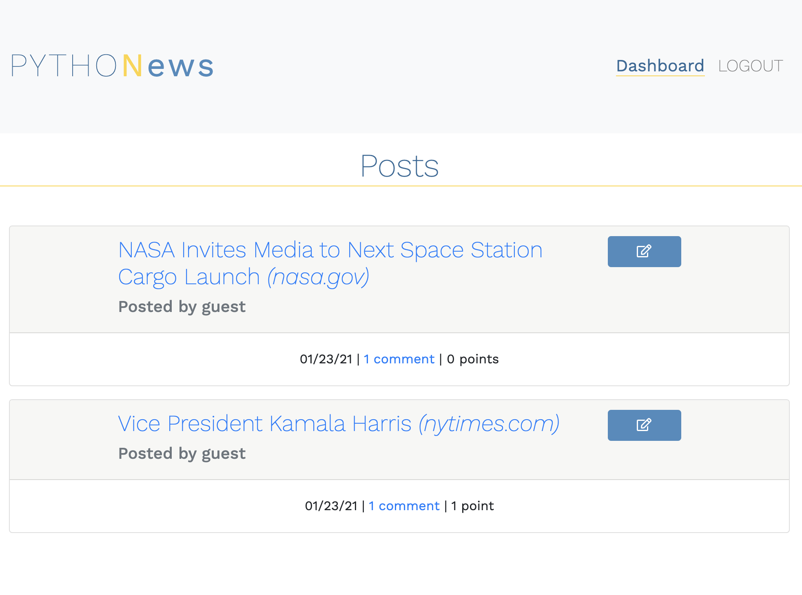
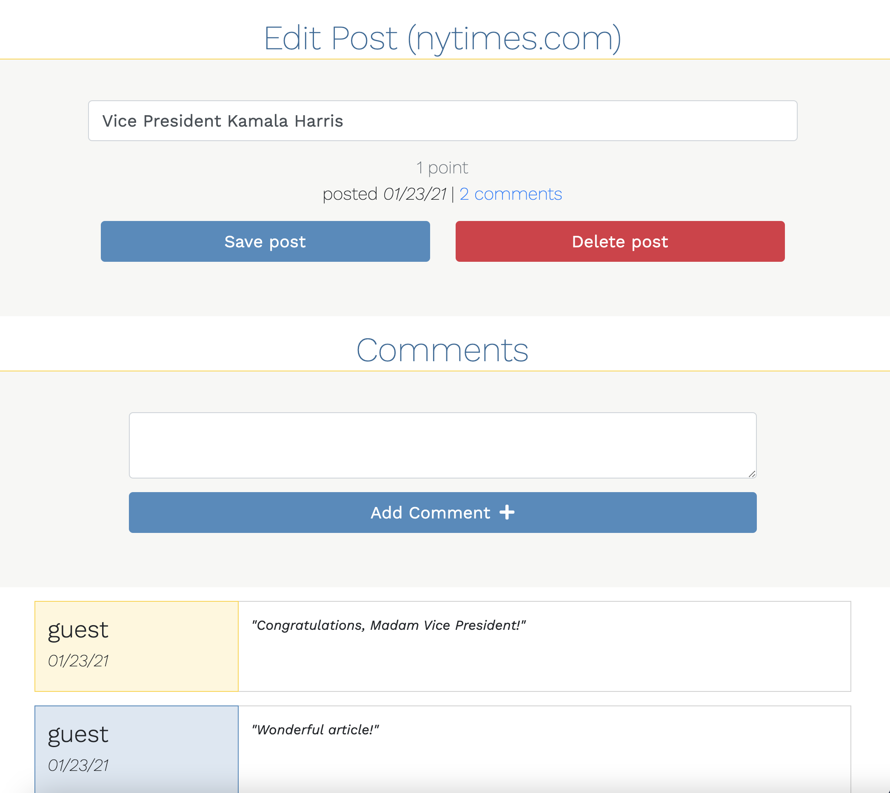

# Python News Application

## Deployed Application 

[Python News App](https://python-newsapp-mh.herokuapp.com/)

## Description

This application, built with a Python/Flask back-end, allows an authenticated user to create posts for links/articles of interest as well as comment and upvote on posts.

When the user navigates to the homepage, a list of all saved posts will be rendered, and the user can navigate to the 'Sign In' page to either sign in as a guest, create a new account, or log into another existing account. Once authenticated, the user may create a post by pasting a link and writing a title of choice. Once posted, the user may edit their post titles. The user also has the capability of writing comments on posts, deleting posts, and upvoting favorite posts.

This application's back-end communicates with a MySQL Database using SQLAlchemy. On the front-end, Python Jinja templating is used to dynamically render data. Routes are protected using decorator/middleware functions. For security purposes, bcrypt is used to encrypt passwords.

## Features

* Python back-end with Flask routing
* SQLAlchemy ORM used to model data and simplify CRUD operations
* Bcrypt securely stores passwords
* Jinja templating used to dynamically render data in HTML
* Routes requiring authentication are secured using Python decorator functions as route middleware
* Bootstrap 4 components including grid, navbar, cards, and modals 
* Responsive to a wide variety of screen sizes using Bootstrap and supporting Media Queries

## Contact

Michael Hanson
* michaeledwardhanson@gmail.com
* [GitHub](https://github.com/mhans003)
* [LinkedIn](https://www.linkedin.com/in/michaeledwardhanson/)

## License

Licensed under the [MIT License](./LICENSE.txt).